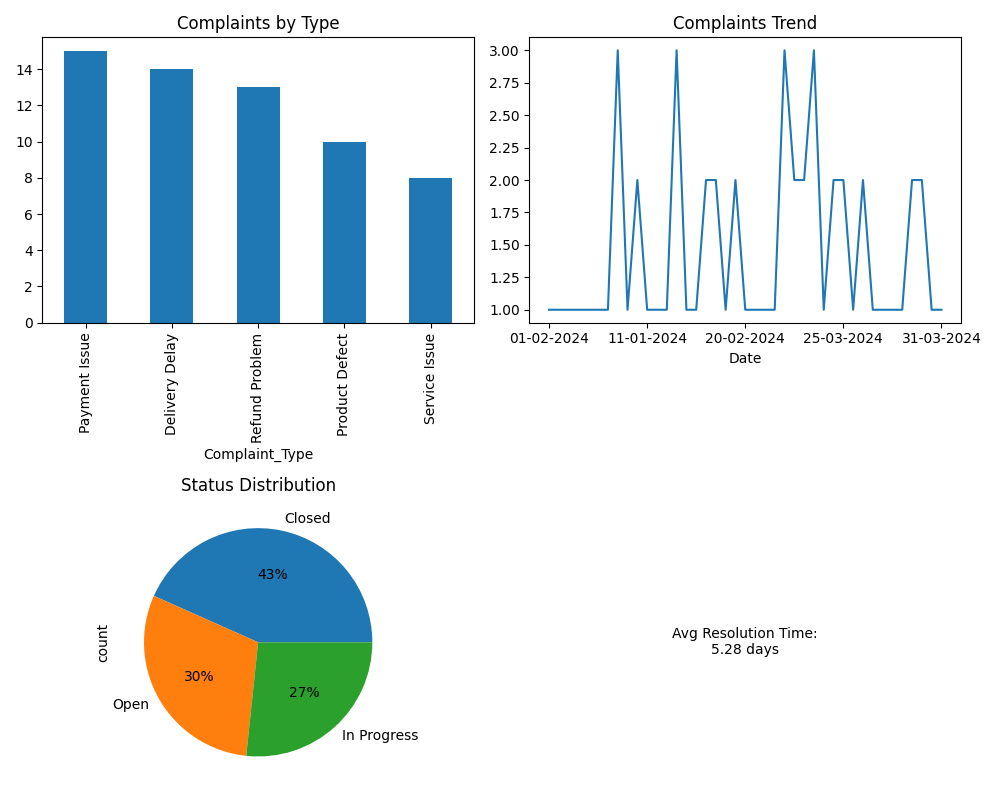

# Customer Insights Dashboard

## Overview
Analysed customer complaints data to identify trends and improve service performance.

## Dashboard Preview

## Tools Used
- Excel
- Data Analysis

## Key Insights
- Payment Issues and Delivery Delays are the most frequent complaints
- Average resolution time is ~5 days
- Majority of complaints are closed, but some remain open/in progress

## Impact
Improves decision-making and helps reduce customer complaints
